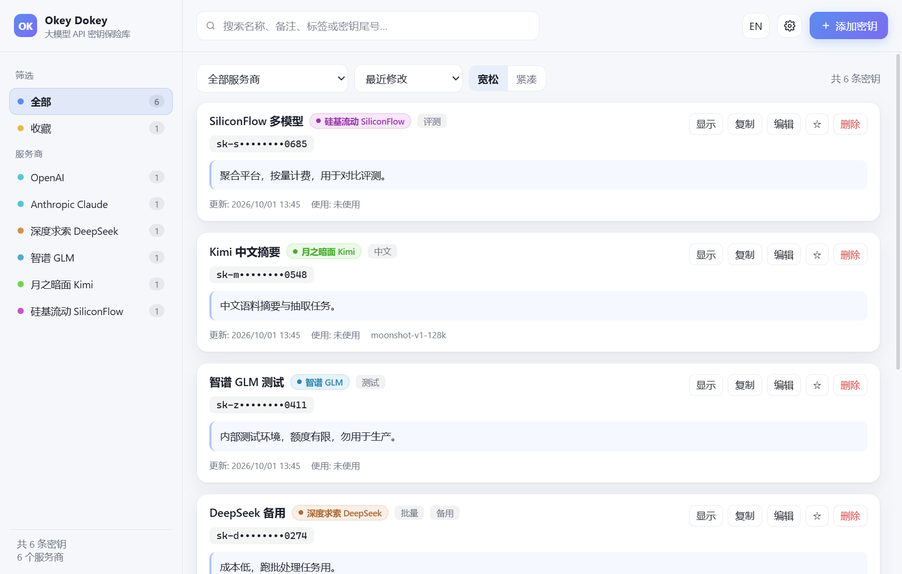

# Okey Dokey

> 大模型 API 密钥保险库 · LLM API key vault

把各家大模型的 API Key 加密存在本机，用服务商筛选、给每条密钥写备注；界面配色与背景可自定义，中英双语。

基于 Electron，数据以 **AES-256-GCM** 加密后落盘，明文密钥不写入磁盘。



---

## 目录结构

```
okey-dokey/
├─ src/
│  ├─ main/                 主进程（Node 环境，唯一接触文件系统与明文密钥的地方）
│  │  ├─ index.js             窗口、IPC、剪贴板、导入导出
│  │  ├─ store.js             加密仓库：增删改查、掩码、导入导出
│  │  └─ crypto.js            AES-256-GCM 加解密、scrypt 派生、加密导出包
│  ├─ preload/
│  │  └─ index.js           上下文桥：向界面暴露白名单方法（contextIsolation）
│  ├─ renderer/             渲染进程（界面，不直接接触文件系统）
│  │  ├─ index.html           界面骨架
│  │  ├─ styles.css           样式表（主题全部变量化）
│  │  ├─ app.js               列表、筛选、编辑、设置、主题、双语
│  │  └─ i18n.js              中英词条
│  └─ shared/
│     └─ providers.js       24 家服务商目录（主进程与界面共用）
├─ scripts/                 开发与验证脚本（不进入发布包）
│  ├─ smoke.js                端到端界面冒烟测试（18 项）
│  ├─ screenshot.js           生成界面截图
│  ├─ bench-startup.ps1       启动耗时基准测试
│  ├─ test-doubleclick.ps1    目录版真实启动方式验证
│  ├─ verify-build.ps1        打包产物实机验证
│  ├─ build-variants.js       不同压缩率对照构建
│  └─ make_icon.py            生成应用图标
├─ build/                   electron-builder 图标资源（随仓库提交）
│  ├─ icon.ico
│  └─ icon.png
├─ docs/                    文档与截图
│  ├─ startup-performance.md  启动性能分析与实测数据
│  └─ images/
└─ release/                 构建输出（不入库，见 .gitignore）
   ├─ win-unpacked/           目录版（免安装，启动最快）
   └─ Okey-Dokey-Setup-*.exe  安装版
```

## 快速开始

```powershell
npm install     # 首次运行，安装 Electron（约 1 分钟）
npm start       # 启动应用
```

## 两个发布版本

打包产物都输出到 `release/`（已加入 `.gitignore`，不入库）。

| 版本 | 生成命令 | 产物 | 启动耗时 | 适用场景 |
| --- | --- | --- | --- | --- |
| **目录版** | `npm run dist` | `release/win-unpacked/` | ~0.35 s | 免安装，整个文件夹拷走即用，可放 U 盘 |
| **安装版** | `npm run dist:installer` | `release/Okey-Dokey-Setup-1.0.0.exe` | ~0.35 s | 装进系统，带开始菜单与桌面快捷方式 |

> 目录版请**整个文件夹一起移动**，只拷 `Okey Dokey.exe` 无法运行（缺运行时与 `resources/`）。

两个版本的实机启动截图：[目录版](docs/images/ui-directory-build.png) · [安装版](docs/images/ui-installed.png)

### 关于便携版（单文件 exe）

本项目**不提供**单文件便携版：它每次启动都要把 Electron 运行时（约 460 MB）解压到临时目录，实测启动需 **6.2 秒**，是目录版的 19 倍。实测数据见 [docs/startup-performance.md](docs/startup-performance.md)。

## 功能

| 需求 | 实现 |
| --- | --- |
| 加密保存密钥 | AES-256-GCM 整库加密；密钥由 scrypt 从本机设备密钥派生；明文不落盘 |
| 服务商筛选 | 内置 24 家服务商，下拉框 + 侧栏筛选，附条数统计 |
| Key 备注 | 多行备注 + 标签 + Base URL + 常用模型，备注可被搜索 |
| 简约风前端 | 单栏卡片、克制留白与圆角 |
| 自定义配色主题 | 6 套预设（含 2 套暗色）+ 主色/辅助色/背景/卡片/文字/圆角独立调节 |
| 背景图透明度 | 选图后可调透明度、模糊、压暗与填充方式 |
| 中英双语 | 一键切换，语言与主题持久化 |

其他：搜索覆盖名称/备注/标签/服务商/模型/密钥尾号；5 种排序与列表密度；收藏夹；显示密钥倒计时自动隐藏；复制后 30 秒清空剪贴板；掩码样式三选一；加密备份导出与导入。

## 安全设计

- **算法**：AES-256-GCM（带认证标签，防篡改）。
- **密钥派生**：scrypt（N=16384, r=8, p=1），密钥保存在用户数据目录，打开即用，无需主密码。
- **明文不经过界面**：渲染进程默认只拿到掩码（如 `sk-a••••••••7890`），点击「显示」才由主进程返回明文。
- **导入导出**：加密包用口令保护（scrypt N=32768），跨设备恢复需同一口令。

> ⚠️ **取舍**：本机密钥自动解锁意味着「拿到本机 `device.key` 的人可直接解密密钥库」。请勿把数据目录同步到公共云盘。
> 如需升级为主密码解锁，请提 issue。

数据文件位于 `%APPDATA%\Okey Dokey\vault\`：`vault.enc`（密文库）、`device.key`（设备密钥）、`settings.json`（设置，不含密钥）。

## 开发与验证

```powershell
npm run check                                  # 语法检查
npm run test:smoke                             # 端到端界面测试（18 项）
npm run test:startup                           # 启动耗时基准
npm run test:doubleclick                       # 目录版真实启动方式验证
npm run shots                                  # 重新生成界面截图
npm run icon                                   # 重新生成图标
powershell -File scripts/verify-build.ps1 -Target unpacked   # 打包产物实机验证
```

## 已知限制

- **无便携版**：见上文性能说明。
- **构建需磁盘空间**：每次打包会在 `release/` 写出约 460 MB 解包目录，空间不足会报 `ENOSPC`。
- **未做代码签名**：安装版首次运行可能触发 Windows SmartScreen「未知发布者」提示。
- **Windows 优先**：配置仅提供 Windows 目标；macOS/Linux 目标未验证。
- **未做分页**：密钥数量上万时列表未优化。
- **字体**：使用系统字体，未内嵌。

## 许可证

MIT
